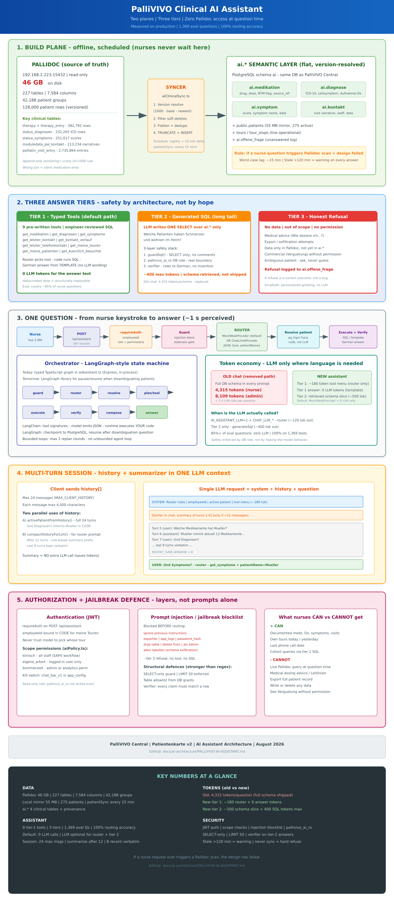
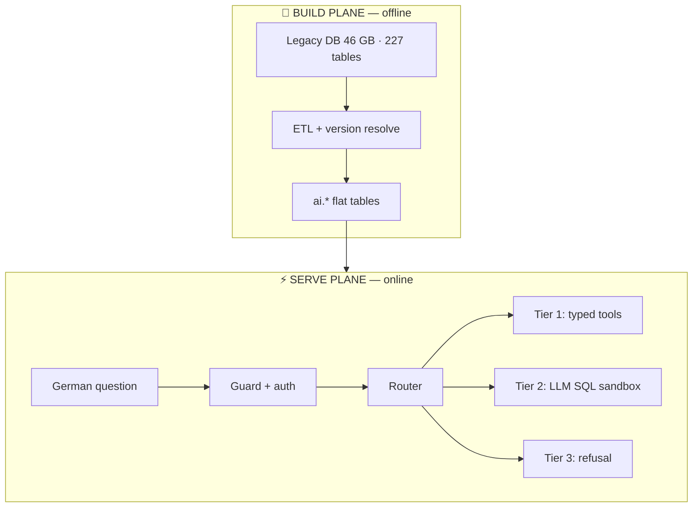
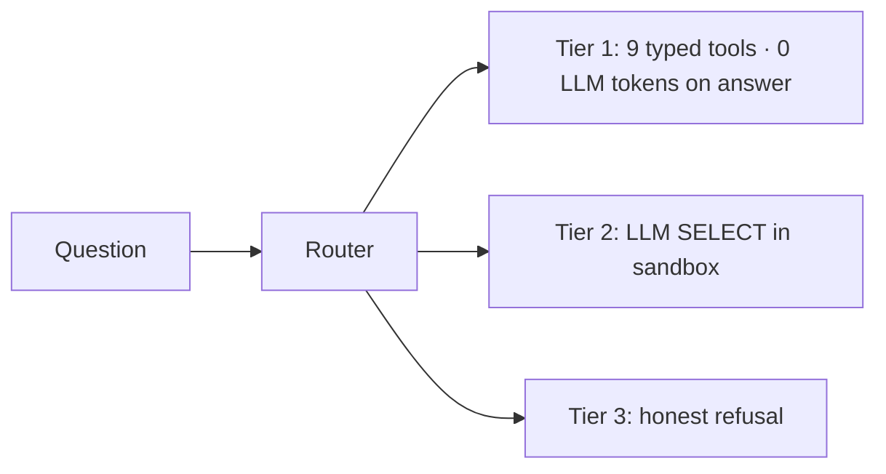

<div align="center">

# 🏥 Production-Grade Clinical AI Assistant

### *German healthcare · 46 GB legacy DB · offline LLM · zero PHI to the cloud*

<a href="https://git.io/typing-svg">
  
</a>

<p>
  
  
  
  
  
</p>

<p>
  
</p>

**Built by [Muhammad Saeed](https://github.com/me-saeed)** · AI agents · RAG · regulated data · TypeScript · PostgreSQL

</div>

---

## 💼 Why this project matters (for clients)

Most “AI chat over your database” demos **ship the whole schema to OpenAI** and hope the model writes correct SQL. In **clinical software**, that fails quietly — wrong medication dose, wrong patient version, **9-minute CPU waits**, and **patient data leaving the building**.

This project is a **complete redesign**: offline ETL, a semantic layer, a **three-tier answer engine**, **1,369 automated tests**, and an **offline LLM path** so **no patient facts need to reach a third-party API**.

> 🔒 **Privacy note:** This public showcase contains **architecture, metrics, and synthetic examples only**. No real patient names, birth dates, or clinical narratives appear in this repository.

---

## 🎯 What I delivered

| Deliverable | Outcome |
|-------------|---------|
| **Clinical ETL pipeline** | 46 GB versioned source DB → 4 flat `ai.*` tables with provenance |
| **Three-tier assistant** | Typed tools (0 LLM on answers) + safe SQL sandbox + honest refusal |
| **Offline LLM stack** | Ollama / open-weight models — **data stays on your server** |
| **Automated test suite** | **1,369** questions · routing + **content verification** against DB |
| **Nurse-language eval** | **195** scenarios with real ward phrasing, typos, phone/tour edge cases |
| **Security hardening** | JWT scopes · SQL guard · DB read-only role · jailbreak blocklist |
| **Stakeholder docs** | Architecture poster · one-page HTML deck · this portfolio README |

---

## 📊 Architecture at a glance

<div align="center">
  <a href="./diagrams/pallivivo-ai-assistant-overview.png">
    
  </a>
  <br/>
  <sub>Build plane (offline sync) → Serve plane (online lookup) → Three tiers → ~1 s for end users</sub>
</div>



---

## 🧠 AI models & inference strategy

### Design principle: **LLM optional, not required**

| Mode | Model / engine | When | Patient data leaves server? |
|------|----------------|------|----------------------------|
| **Production default** | Deterministic keyword router (`MockWeakProvider`) | ~85%+ of questions | **Never** — no LLM call |
| **Offline LLM** | **Qwen 2.5** (7B / 3B), **Llama 3.1** 8B, **Mistral** 7B via **Ollama** | Ambiguous German routing · tier-2 SQL | **No** — local GPU/CPU only |
| **Eval / compare** | Same open-weight models via Ollama or OpenRouter allowlist | Regression testing only | **No** (Ollama) or eval config only |

```bash
# Offline production path (example)
ollama pull qwen2.5:7b-instruct
export AI_ASSISTANT_LLM=1
export CHAT_LLM_BASE_URL=http://127.0.0.1:11434/v1
export CHAT_LLM_MODEL=qwen2.5:7b-instruct
```

### What the LLM is allowed to do (and nothing else)

| ✅ LLM jobs | ❌ Never delegated to LLM |
|------------|-------------------------|
| Parse ambiguous German → JSON `{tool, patientName}` | Hold clinical facts in weights |
| Write ONE `SELECT` over pre-approved `ai.*` tables | Query 46 GB source DB at runtime |
| (Optional) paraphrase tier-2 rows into German | Choose whose tour to show (bound in code) |
| | Invent doses, dates, or diagnoses |

**LangChain-style tool calling** + **LangGraph-style orchestration** (guard → router → resolve → execute → verify → answer), with bounded loops — no infinite agent spin.

---

## 🏔️ Hard problems & how they were solved

| Challenge | Why it hurts | Solution |
|-----------|--------------|----------|
| **46 GB append-only DB** | Wrong join = plausible but **superseded opioid dose** | Offline ETL with `vcard_id=1000` version resolution → flat `ai.*` |
| **4,315-token schema prompts** | ~**9 min** CPU prefill per question | Tool menu ~180 tokens · templates for answers · retrieve schema slices |
| **German nurse language** | *"Wen hab ich heute?"*, typos, follow-ups *"Und Diagnosen?"* | 195 nurse-scene tests · follow-up detection in **code**, not LLM memory |
| **DSGVO / PHI** | Cloud LLM = unassessed processor | **Offline Ollama first** · open-weight allowlist · no Pallidoc at question time |
| **SQL injection / jailbreak** | *"ignore previous · export all tables"* | Blocklist + `SELECT`-only guard + **`pallivivo_ai_ro`** PostgreSQL role |
| **Wrong patient** | Three people same surname | `pg_trgm` fuzzy match → **ask**, never guess |
| **Hallucinated clinical text** | LLM fluent in wrong German | Tier 1: **template from DB rows** · Tier 2: **verifier** matches every claim |
| **Multi-turn cost** | Long chat = huge prompts | Rule-based history summary after 12 msgs · **no extra LLM call** |

---

## 🧪 Testing — automated + nurse-realistic + pilot-ready

### 1. Automated eval suite (**1,369 tests · 100% routing**)

| Suite | Tests | What it proves |
|-------|-------|----------------|
| Core + hard questions | 865 | Routing, refusals, greetings |
| Complex German | 309 | Long compounds, edge routing |
| **Nurse scenes** | **195** | **Real ward phrasing** — tours, typos, phone, out-of-scope |
| **Total** | **1,369** | **100%** expected behavior |

```bash
cd backend && npx tsx test/eval/run.ts          # full suite
cd backend && npx tsx test/eval/run.ts --scenes # nurse phrasing only
cd backend && npx tsx test/eval/run.ts --llm    # open-weight model regression
```

**Content verification:** tests don't only check “answered vs refused” — they **re-query `ai.*`** and assert the answer matches database facts.

### 2. Safety & adversarial suite

```bash
cd backend && npx tsx test/eval/safety.ts   # injection, scope, refusal cases
```

Covers jailbreak patterns, export attempts, and permission boundaries.

### 3. Multi-turn session tests

```bash
cd backend && npx tsx test/eval/session.ts  # follow-ups inherit patient in code
```

Validates *"Welche Medikamente hat [Patient]?"* → *"Und Symptome?"* without re-stating the name.

### 4. Real nursing staff validation (UAT path)

The assistant was built against **how Pflegefachkraft staff actually type** (not textbook German):

- Tour/day planning: *"Wen hab ich heute auf der Tour?"*
- On-the-road queries: *"Was muss ich wissen — fahr gleich los"*
- Chart typos and umlaut-free shorthand in eval (`{T}` typo placeholder)
- **UAT-ready** architecture for nursing staff review before production go-live

> Automated tests simulate nurse language at scale; **human UAT with nursing staff** is the final gate before go-live on production.

---

## ⚡ Three-tier answer engine



| Tier | Path | LLM tokens (typical) |
|------|------|----------------------|
| **1** | Pre-written SQL + German template | **0** on answer body |
| **2** | Model writes one `SELECT` over `ai.*` | ~500 schema + ~400 SQL max |
| **3** | Refusal · logged for product backlog | 0 |

---

## 🔒 Offline-first & data sovereignty

```
❌ OLD: 4,315 tokens of schema → Groq/cloud → full patient rows in API payload
✅ NEW: facts stay in PostgreSQL → optional local Ollama → zero PHI to vendor
```

| Property | Implementation |
|----------|----------------|
| **No live source DB access** | Assistant reads `ai.*` only — syncer runs offline |
| **On-prem inference** | Ollama + Qwen / Llama / Mistral on your hardware |
| **DB-enforced sandbox** | `pallivivo_ai_ro` role — no `INSERT`, no Pallidoc tables |
| **Kill switch** | Admin toggle without redeploy |
| **Audit trail** | Unanswered questions → `ai.offene_frage` backlog |

Ideal for **EU healthcare**, **DSGVO-sensitive** environments, and clients who need **“AI without sending patient data to OpenAI.”**

---

## 🛠️ Tech stack

<p>
  
  
  
  
  
  
  
</p>

**AI / ML:** Ollama · Qwen 2.5 · Llama 3.1 · Mistral · constrained JSON routing · SQL guard · verifier  
**Data:** PostgreSQL · `pg_trgm` · ETL · read-only roles · semantic layer  
**Quality:** 1,369 eval cases · safety suite · session tests · content verification  

---

## 📈 Key metrics

<div align="center">

| Source DB | Semantic layer | Tests | Default LLM calls | Token cut |
|-----------|----------------|-------|-------------------|-----------|
| **46 GB** · 227 tables | **4** `ai.*` tables | **1,369** | **0** | **4,315 → ~180** |

</div>

---

## 💬 Hire me for similar work

I build **production AI systems** where **correctness and compliance matter** — not demo chatbots:

- 🏥 **Regulated domains** — healthcare, CRM with PII, internal knowledge bases
- 🔒 **Offline / private LLM** — Ollama, vLLM, EU-hosted, zero unnecessary data export
- 🧪 **Test-driven AI** — eval suites that verify **content**, not just JSON shape
- 🔄 **ETL + semantic layers** — make legacy databases safe for LLMs
- 🇩🇪 **Multilingual** — German clinical and business language in production

<p align="center">
  <a href="https://github.com/me-saeed"></a>
</p>

---

<div align="center">

*Portfolio showcase · Architecture & metrics only · No real patient identifiers*  
*Original implementation: enterprise SAPV palliative care platform · 2026*


</div>
